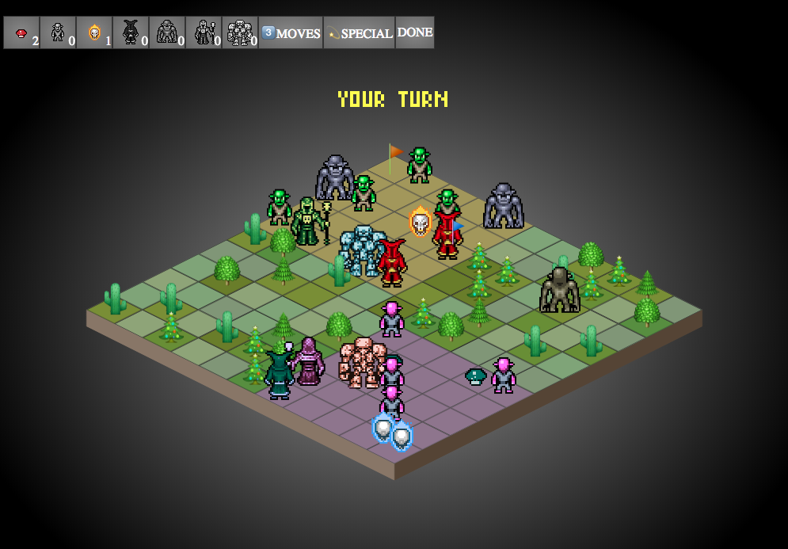
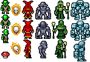

# Battle Chess

...is a browser-based turn-based strategy game programmed in javascript and CSS with the aim of satisfying a project size constraint of a single file under 20KB in size.

You can play the [full game on itch.io](https://mn3monic.itch.io/battle-chess), although that version weighs in at 35KB minified and non-gzipped, and has lots more nice features than the 20KB branch.



## Why?

Just for fun really, and to learn about minification, code golf, ES6 and micro-coding in the vein of js1k, js13k and the demoscene.


# How this was made

During development, a lot of decisions had to be made to keep the size of the codebase to a minimum. Reusable code, abbreviations, clever tricks and minimalism were *de rigueur*.

## Assets

Nice small sprites were found courtesy of [Redshrike on OpenGameArt](https://opengameart.org/users/redshrike). These were arranged and the colour depth decreased to 8 colours per sprite in Photoshop, and saved in GIF format to keep the size as low as possible.



These were displayed scaled up to 200% with `image-rendering: pixelated` turned on.

I then used CSS's `filter: hue-rotate(180deg)` to create a full set of enemy sprites at run-time with no extra graphics needed!

All the game's trees, and a few other things, are simply Unicode characters: 🎄🌲🌳🌵

An extremely light-weight alternative to bulky sprites!

## CSS

The game's CSS was ultimately quite heavy, at some 415 lines uncompressed (~8KB). Notable features included:

* use of CSS Grid which is just perfect for displaying board games
* the isometric view is created with a `transform: rotateX(60deg) rotateZ(45deg)`
* unfortunately this transform needs to be "undone" for all the items placed within the board!
* `::before` and `::after` pseudo-elements used for the board edges
* extensive use of `filter`s, with `sepia`, `invert`, `hue-rotate`, `brightness` and `drop-shadow` all finding a purpose
* keyframe animations were used for momentary visual effects such as shakes, bounces, flashes, etc

## ES6 Javascript

ES6 classes, arrow functions, destructurings, default arguments... were just some of the ES6 pleasures which kept the javascript a little more minimal. This project doesn't have to run on old browsers.

## No frameworks, minimal libraries

With a target size of 20KB, impossible to use jQuery, Velocity, or any powerful DOM library.

I allowed myself the following indulgences:

* [jsfxr](https://github.com/grumdrig/jsfxr), sound effect synthesizer [3.2KB]
* [TinyAnimate](https://github.com/branneman/TinyAnimate), (slimmed down) allowing basic DOM animations [1.7KB]
* [PixelFont](https://github.com/PaulBGD/PixelFont), (modified) a way of rendering a retro "font" on canvas elements [1.4KB]

## Sounds

The jsfxr library weighs a few KB but is well worth it for the wide range of 8-bit sounds it can reproduce using only a setting strings.

Example:
```javascript
var sounds = {
	jump:	"0,,0.23,,0.2242,0.33,,0.2217,,,,,,0.3816,,,,,1,,,0.0371,,0.5",
	play: name => {
		var player = new Audio();
		player.src = jsfxr(sounds[name].split(",").map(s => parseFloat(s)));
		player.play();
	}
}
sounds.play('jump');
```

## AI

A good AI is essential in a strategy game played against a computer. This game, however, only has a very basic AI. With limited time and space, I tried to use some of the principles employed by chess computers:

* a basic heuristic for where to move, in this case, nearer to the player's flag
* a scoring of a piece's possible moves, based on the values of the pieces they could take
* a random element

It feels like a competent AI for playing this game could soon end up being 20KB in its own right!

## Bundling

[Gulp](https://gulpjs.com/) was my tool of choice to create a one-file bundle. My single shot workflow consisted of:

* concatenate and minify all javascripts
* compress all CSS and inline any referenced images as base64-encoded strings
* inject CSS into the document head and JS below the body content


# Updates

Don't expect many future updates here. The game could be a lot more polished but it's not a priority. Feel free to fork and play if you wish.

# License

This project is released under the MIT license.
